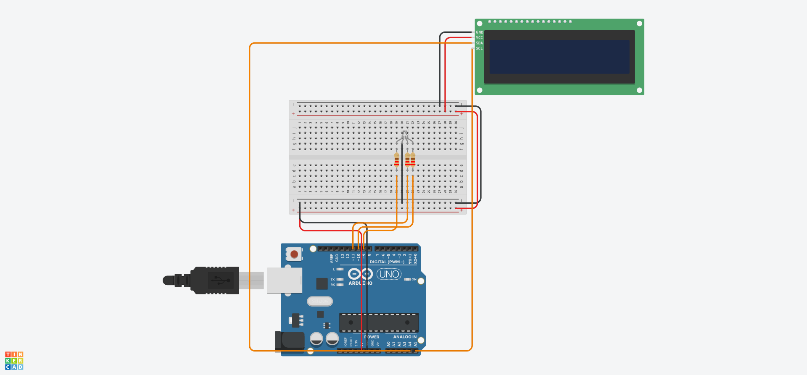

# I2C LCD Display and RGB LED Synchronization

This project demonstrates the integration of a 16x2 LCD display using I2C communication alongside the control of an RGB LED on the Arduino platform[cite: 3]. The system synchronizes the text-based visual feedback on the display with the physical color changes of the LED.

## Features and Logic

* **I2C Communication:** The project uses the `Adafruit_LiquidCrystal.h` library to manage the display via the I2C bus (address 0 in the Tinkercad simulator), which saves digital pins on the Arduino board.
* **Initialization:** During `setup()`, the LCD backlight is turned on, and a validation message reading "Sistema I2C OK" is displayed for 2 seconds.
* **Color Cycling:** In the main loop, the system automatically cycles through three distinct states, each lasting for an interval of 2 seconds.
* **Feedback Synchronization:** With each state change, the display is cleared and updated to show "Cor:" (Color:) on the first row, followed by the current color indication (e.g., "-> VERMELHO", "-> VERDE", or "-> AZUL") on the second row.
* **Modular Code:** The algorithm utilizes a dedicated custom function `definirCorRGB(int valorVermelho, int valorVerde, int valorAzul)` that takes the intensity parameters and applies the signal via `analogWrite` to the respective pins.

## Pinout and Connections

| Component | Arduino Pin | Configuration | Description |
| :--- | :---: | :---: | :--- |
| **RGB LED (Red)** | `Pin 9` | OUTPUT | Controls the red channel (R) via PWM signal |
| **RGB LED (Green)** | `Pin 10` | OUTPUT | Controls the green channel (G) via PWM signal |
| **RGB LED (Blue)** | `Pin 11` | OUTPUT | Controls the blue channel (B) via PWM signal |
| **I2C LCD (SDA)** | `A4` | I2C Data | Data line for the I2C bus |
| **I2C LCD (SCL)** | `A5` | I2C Clock | Clock line for the I2C bus |

## Circuit Schematic

Below is the component layout and the I2C connections simulated using the Tinkercad platform:

