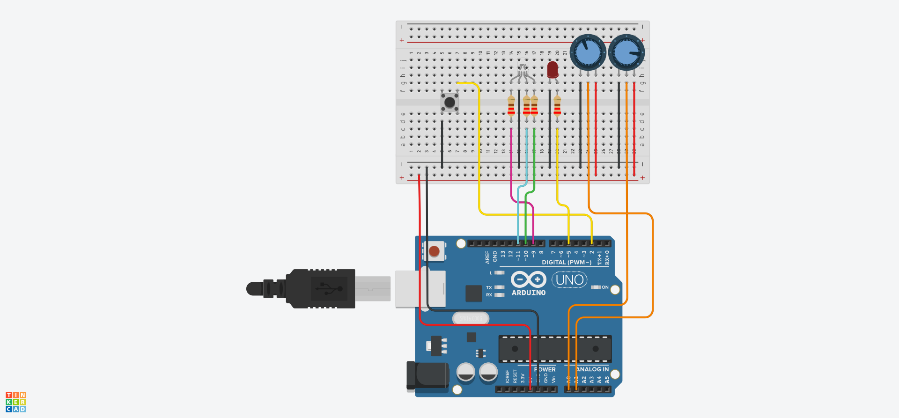

# PWM Control System with Automatic Calibration

This project implements an advanced PWM signal control system using the Arduino platform[cite: 2]. The system features independent increment and decrement adjustments, along with a built-in automatic hardware calibration mode[cite: 2].

## Features and Control Logic

* **Dual Control:** The system utilizes two distinct potentiometers: one dedicated to increasing the PWM value and another to decreasing it[cite: 2]. The variable mapping includes a dead zone constant to prevent instability and noise in the analog readings[cite: 2].
* **Multifunctional Button:** The system has a main control button on pin 2 that detects the press duration (short or long click) using the `millis()` function[cite: 2]. A short click toggles the system on and off, entering standby mode[cite: 2]. A long click (3 seconds or more) initiates the potentiometer calibration routine[cite: 2].
* **Automatic Calibration:** For an interval of 5 seconds, the user must rotate the potentiometers so the system can record the actual minimum and maximum sensor values[cite: 2]. This process ensures greater accuracy when mapping the analog signals[cite: 2].
* **Visual Feedback (RGB LED):** The operating state of the system is continuously reported through an RGB LED[cite: 2]. A solid blue color indicates that the system is in standby mode[cite: 2]. The green color lights up proportionally when increasing the PWM value[cite: 2]. The red color lights up proportionally when decreasing the PWM value[cite: 2]. A flashing purple color indicates that the calibration mode is currently in progress[cite: 2].
* **Serial Monitoring:** Changes in the main PWM value, sensor readings, and calibration status are sent to the serial monitor operating at a baud rate of 9600[cite: 2].

## Pinout and Connections

| Component | Arduino Pin | Configuration | Description |
| :--- | :---: | :---: | :--- |
| **Increase Potentiometer** | `A0` | ANALOG IN | Reads the analog signal to increment the PWM[cite: 2] |
| **Decrease Potentiometer** | `A1` | ANALOG IN | Reads the analog signal to decrement the PWM[cite: 2] |
| **RGB LED (Red)** | `Pin 9` | OUTPUT | Control for the red channel of the feedback LED[cite: 2] |
| **RGB LED (Green)** | `Pin 10` | OUTPUT | Control for the green channel of the feedback LED[cite: 2] |
| **RGB LED (Blue)** | `Pin 11` | OUTPUT | Control for the blue channel of the feedback LED[cite: 2] |
| **Main PWM Output** | `Pin 5` | OUTPUT | Final output of the controlled PWM signal[cite: 2] |
| **Control Button** | `Pin 2` | INPUT_PULLUP | Multifunctional button utilizing the internal pull-up resistor[cite: 2] |

## Circuit Schematic

Below is the component layout designed and simulated using the Tinkercad platform:

