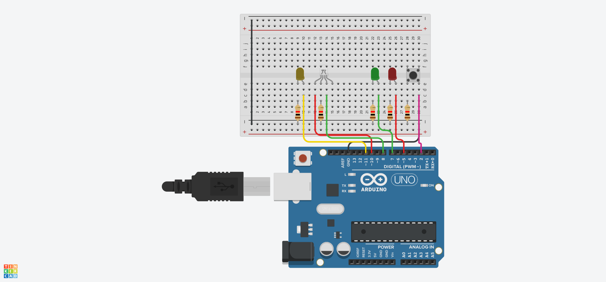

[Read this in English](README_EN.md)
# Semáforo Inteligente de Veículos e Pedestres

Este projeto consiste na implementação de um sistema de controlo para um semáforo de veículos e pedestres utilizando o Arduino. O sistema opera de forma híbrida: funciona de modo automático por temporização, mas permite a interação do pedestre através de um botão de pressão (push-button), respeitando tempos mínimos de segurança para não interromper o tráfego abruptamente.

## Funcionalidades e Lógica de Controlo

O algoritmo foi desenvolvido utilizando a função `millis()` para criar uma estrutura de temporização não-bloqueante no estado inicial, permitindo a leitura constante do botão:

1. **Modo Automático:** Se ninguém carregar no botão, o semáforo dos carros fecha automaticamente após 10 segundos para dar a vez aos pedestres.
2. **Interação por Botão:** O pedestre pode solicitar a travessia a qualquer momento. No entanto, o sistema garante um **tempo mínimo de 5 segundos de sinal verde para os carros** antes de processar o pedido, evitando retenções desnecessárias no trânsito.
3. **Ciclo de Travessia Seguro:** * Transição dos carros para a luz amarela (2s) e vermelha (1s de segurança).
   * Sinal verde para pedestres libertado durante 5 segundos fixos.
   * Alerta visual para os pedestres: a luz verde pisca durante 5 segundos antes de fechar, indicando o fim do tempo de travessia.

---

## 🛠️ Componentes Utilizados (Tinkercad)

* **1x** Microcontrolador Arduino Uno
* **1x** Protoboard (Placa de ensaio)
* **1x** LED RGB (Utilizado para o semáforo dos carros: Perna G -> Verde, Perna R -> Vermelho)
* **1x** LED Amarelo (Semáforo dos carros)
* **1x** LED Verde (Semáforo de pedestres)
* **1x** LED Vermelho (Semáforo de pedestres)
* **1x** Botão de Pressão (Push-button com resistor interno *Pull-Up* do Arduino)
* **5x** Resistores de 220Ω (Limitadores de corrente para os LEDs)

---

## Pinagem e Conexões

| Componente | Pino Arduino | Configuração | Descrição |
| :--- | :---: | :---: | :--- |
| **LED Verde (Carros)** | `Pin 8` | OUTPUT | Ligado ao pino G (Green) do LED RGB |
| **LED Vermelho (Carros)** | `Pin 10` | OUTPUT | Ligado ao pino R (Red) do LED RGB |
| **LED Amarelo (Carros)** | `Pin 11` | OUTPUT | Controla o LED amarelo difuso |
| **LED Verde (Pedestres)** | `Pin 7` | OUTPUT | Sinal de autorização de travessia |
| **LED Vermelho (Pedestres)** | `Pin 5` | OUTPUT | Sinal de paragem do pedestre |
| **Botão Pedestre** | `Pin 2` | INPUT_PULLUP | Botão ativo em nível lógico baixo (0V) |

---

## Esquema do Circuito

Abaixo está a disposição dos componentes e das ligações elétricas projetadas e simuladas através da plataforma Tinkercad:

---

## Como Executar o Projeto

1. Cria um novo circuito na tua conta do [Tinkercad](https://www.tinkercad.com/).
2. Monta os componentes seguindo o esquema visual apresentado acima.
3. Copia o código presente no ficheiro `sinal_de_transito.cpp` deste repositório.
4. Na aba **Código** do Tinkercad, muda o modo de edição para **Texto**, cola o código e clica em **Iniciar Simulação**.
