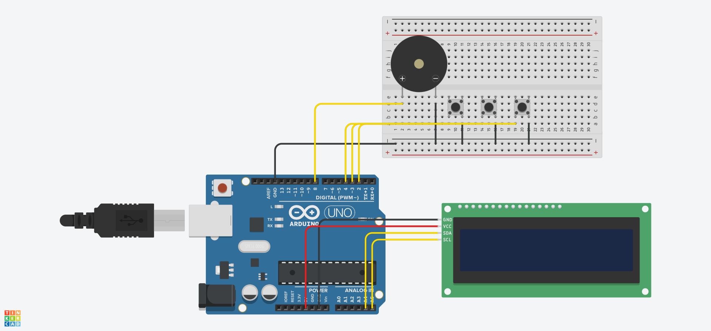

# Electronic Voting System with LCD Interface and Audio Feedback

This project implements a simulated electronic voting machine using the Arduino platform. The system allows the selection and confirmation of votes among 5 pre-defined teams, displaying the interface on an I2C LCD and emitting sound alerts through a piezo buzzer.

## Features and Control Logic

* **State Machine:** The main program flow is structured using a finite state machine (`enum Estado`), transitioning between Welcome, Team Selection, Vote Confirmation, and Registered Vote screens.
* **Navigation and Signal Processing:** Navigation between options is handled by physical buttons configured with internal pull-up resistors. The code includes a software *debounce* routine of 200 milliseconds using the `millis()` function, ensuring that false mechanical readings do not trigger multiple clicks.
* **Audio Feedback (Buzzer):** The system emits short beeps of 50 to 80 milliseconds when navigating options or asking for confirmation. Upon successfully confirming a vote, a short sequence of musical notes is played.
* **Accounting and Serial Monitoring:** An array stores the vote count for each of the 5 teams. After every confirmed vote, the microcontroller transmits an updated tally report and identifies the current leader via the Serial Monitor operating at 9600 bps.

## Pinout and Connections

| Component | Arduino Pin | Configuration | Description |
| :--- | :---: | :---: | :--- |
| **Next Button** | `Pin 2` | INPUT_PULLUP | Advances to the next team in the list |
| **Previous Button** | `Pin 3` | INPUT_PULLUP | Returns to the previous team in the list |
| **Confirm Button** | `Pin 4` | INPUT_PULLUP | Selects and confirms the vote for the current team |
| **Buzzer** | `Pin 8` | OUTPUT | Emits sound signals using the `tone()` function |
| **I2C LCD (SDA)** | `A4` | I2C Data | Data line for display communication |
| **I2C LCD (SCL)** | `A5` | I2C Clock | Clock line for display communication |

## Circuit Schematic

Below is the component layout and circuit connections designed on the Tinkercad platform:

