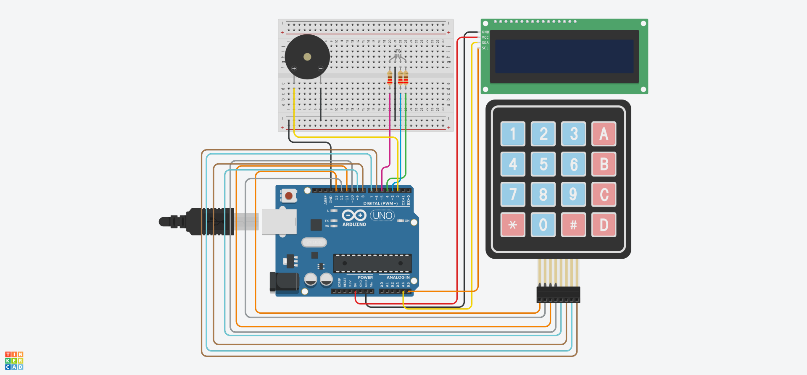

# Electronic Voting Machine v2: Matrix Keypad, I2C Display, and Admin Mode

This project is an upgraded version of an Arduino-based electronic voting system. The circuit has been updated to use a 4x4 matrix keypad for data entry, maintaining the I2C LCD for the user interface, and adding an RGB LED along with a buzzer for multisensory feedback.

## Features and System Logic

* **Matrix Keypad Interface:** Data input is managed by the `Keypad.h` library, mapping the rows and columns to the Arduino's digital pins. The function mapping is as follows:
  * **Keys 0-9:** Input for the candidate number.
  * **Key A:** Confirms the entered vote.
  * **Key B:** Deletes the last entered digit (Backspace).
  * **Key C:** Completely clears the input buffer.
  * **Key D:** Casts a Blank/Null vote.
* **Vote Validation:** The system validates the input against two pre-configured candidates (numbers "10" and "20"). If an invalid number is confirmed, the system temporarily locks the screen and issues an error warning.
* **Administrator Mode (Secret Code):** There is a hidden flow for vote tallying. By typing the sequence `*#*#` and pressing confirm (`A`), the system enters Administrator Mode, displaying the total votes for each candidate and the blank/null votes on the LCD.
* **Multisensory Feedback:**
  * **Visual (RGB LED):** Flashes Green for a successfully registered vote, Red for an invalid number, and Blue when entering administrator mode.
  * **Audio (Buzzer):** Emits a short beep on every key press, a success melody when confirming a vote, a deep long beep for errors, and a high-pitched double beep when accessing the admin panel.

## Pinout and Connections

| Component | Arduino Pin | Configuration | Description |
| :--- | :---: | :---: | :--- |
| **Keypad (Rows)** | `13, 12, 11, 10` | INPUT_PULLUP (via lib) | Pins for the 4 rows of the matrix keypad |
| **Keypad (Cols)** | `9, 8, 7, 6` | OUTPUT (via lib) | Pins for the 4 columns of the matrix keypad |
| **RGB LED (Red)** | `Pin 5` | OUTPUT | PWM signal for the red channel |
| **RGB LED (Green)** | `Pin 4` | OUTPUT | PWM signal for the green channel |
| **RGB LED (Blue)** | `Pin 3` | OUTPUT | PWM signal for the blue channel |
| **Buzzer** | `Pin 2` | OUTPUT | Sound emitter controlled by the `tone()` function |
| **I2C LCD (SDA)** | `A4` | I2C Data | Data line for the I2C bus |
| **I2C LCD (SCL)** | `A5` | I2C Clock | Clock line for the I2C bus |

## Circuit Schematic

Below is the component layout and wiring designed on the Tinkercad platform:

